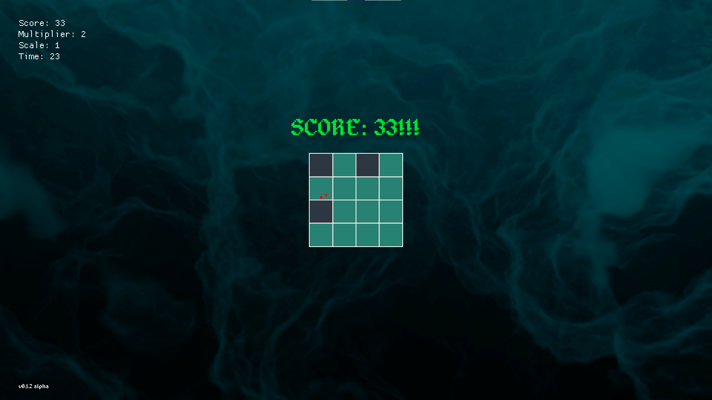

# SquareTap *v0.1.2-alpha*

## What is SquareTap?
SquareTap is a game about clicking tiles as fast as you can. Fast clicks earn more points than slower ones. All this during a 30s timer before the round ends.

## Default keybindings
* Select: Enter
* Back: Escape
* Move up: Arrow up
* Move down: Arrow down

**Note** these only apply once in game:
* Reset game: R
* Hide info: Tab
* Hide grid: G

## Good to know
* Developed with **rustc v1.52.1** and **cargo v1.52.0**
* Game is currently released with pre-built binaries and tested for **Windows 10 (64bit)**.
**But** could still be built and played cross-platform on **Linux** and **MacOS**.
All assets are included in the github-repo under the *"res"* directory.